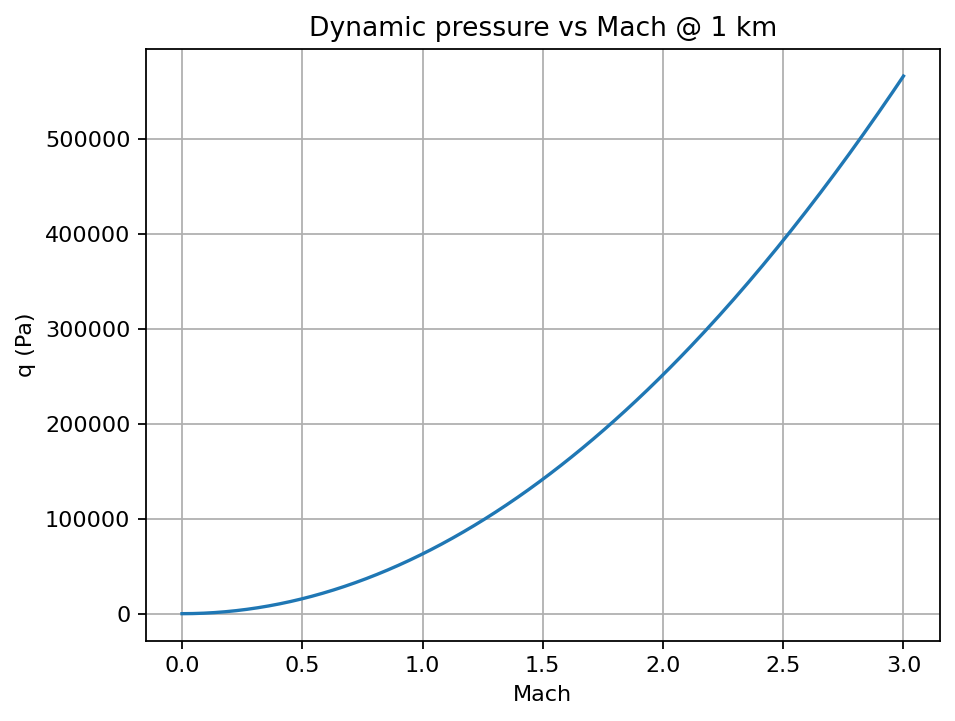
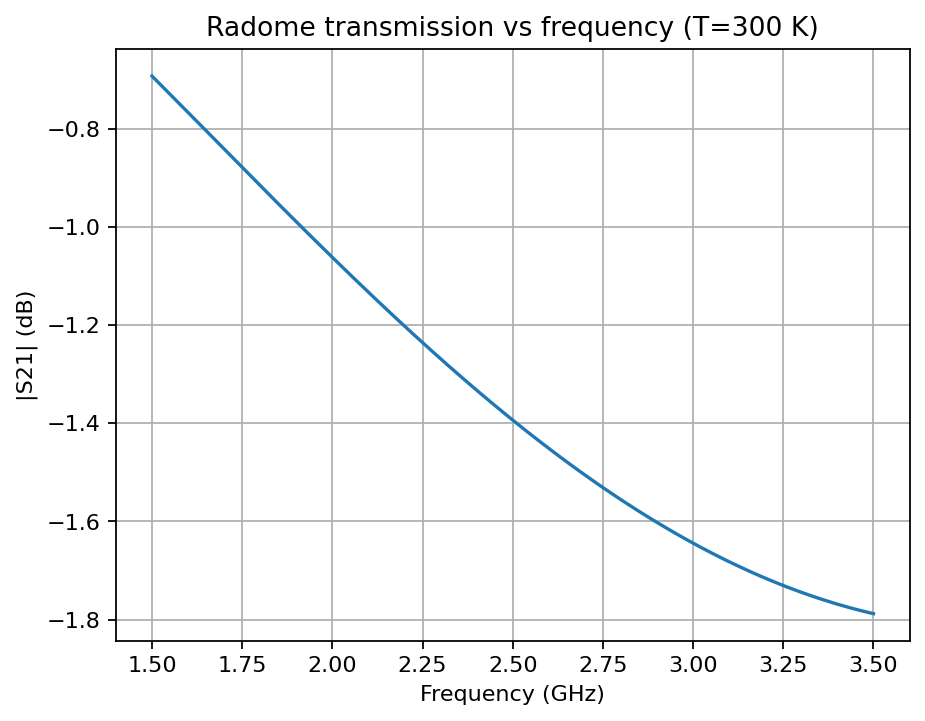
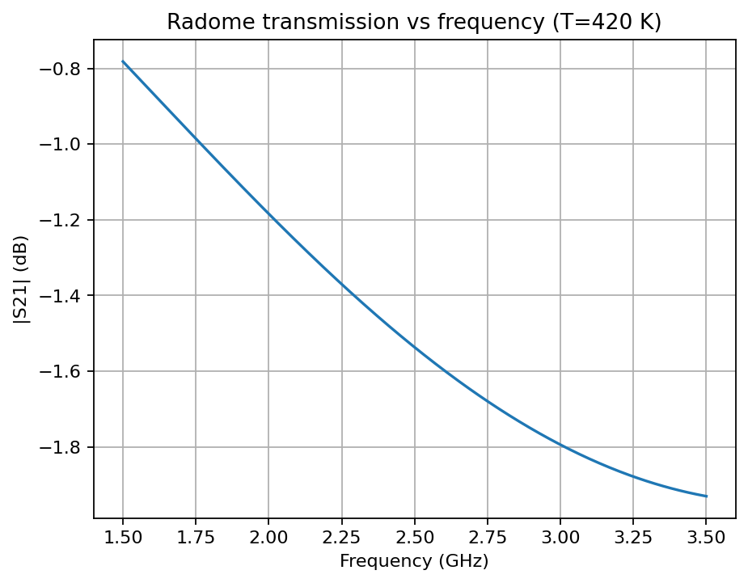

[](https://doi.org/10.5281/zenodo.17408777)
Archived release (v1.0.1): [10.5281/zenodo.17408778](https://doi.org/10.5281/zenodo.17408778)

# AeroRadomeSim
Numerical simulation of Mach-0–3 aerothermodynamics and temperature-dependent radome RF transmission (Python).

## Install (dev)
pip install -e . pytest

## Quickstart
```python
from aeroradomesim.aero import mach_sweep
from aeroradomesim.radome_rf import layer, tmm_s21

# Aerothermo sweep sample
res = mach_sweep(h=1000.0, N=51)
print(res["q"][:3])

# Single-layer radome transmission @ 2.4 GHz, normal incidence
s21 = tmm_s21([2.4e9], [layer(0.010, 3.0, 0.0)], theta=0.0, pol="TE")
print(abs(s21[0]))

## Screenshots


Radome transmission vs frequency  



print(abs(s21[0]))
